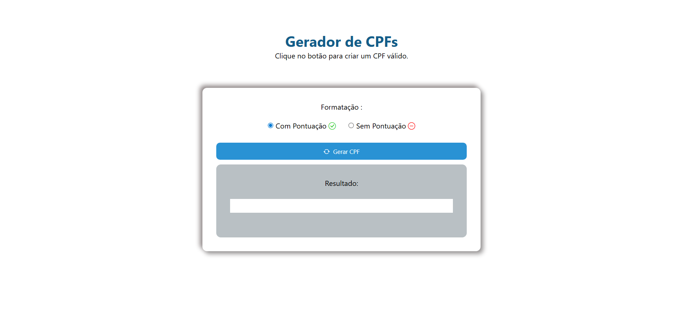
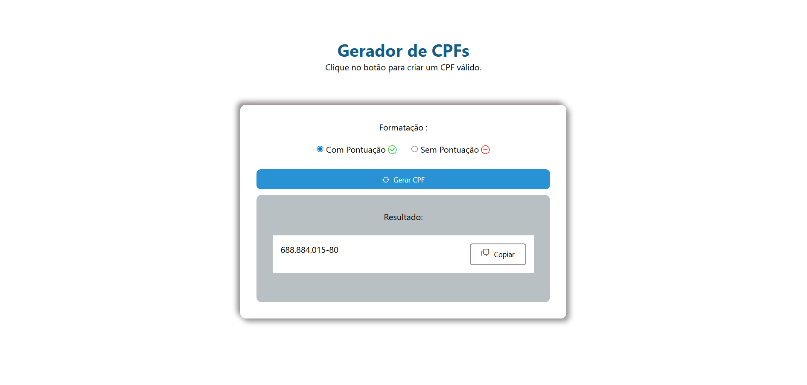
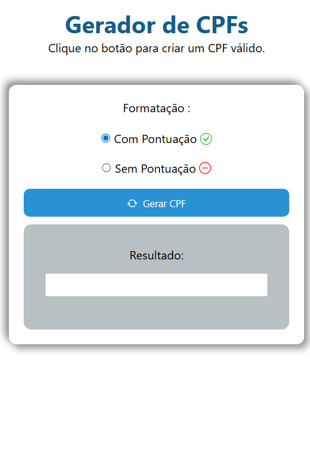
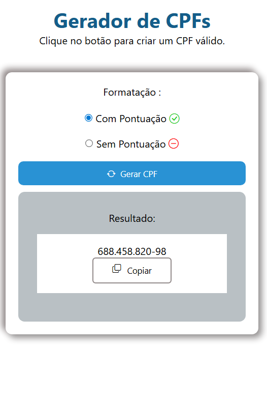
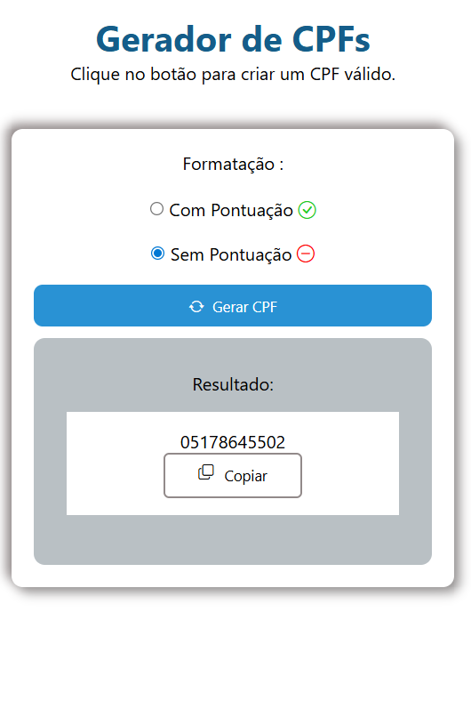

# Gerador de CPFs

Este projeto é um criador de CPFs válidos (Cadastro de Pessoa Física), desenvolvido utilizando HTML, CSS e JavaScript. O objetivo principal deste projeto é colocar os conhecimentos em prática e evoluir as funcionalidades de acordo com o meu aprendizado.

## Funcionalidades
- [x] Geração de CPFs válidos de forma aleatória.
- [x] Opção de formatar com ou sem pontuação (Máscara).
- [x] Funcionalidade de copiar para a área de transferência com um clique.
- [x] Layout responsivo para dispositivos móveis e desktop.
- [ ] Implementação de verificação para evitar números repetidos (Ex: 111.111.111-11). *(Em breve)*

## Tecnologias Utilizadas

- **HTML5**: Estrutura semântica.
- **CSS3**: Estilização personalizada e Media Queries para responsividade.
- **JavaScript (Vanilla)**: Lógica de geração, validação matemática e manipulação do DOM.
- **Bootstrap Icons**: Ícones visuais para melhor experiência do usuário.

##  O que eu aprendi

Este projeto foi um marco para consolidar os seguintes conhecimentos:
1. **Algoritmo de CPF**: Entender como os dois últimos dígitos são calculados com base na soma ponderada dos nove primeiros.
2. **Manipulação do DOM**: Criação dinâmica de elementos (`createElement`) e gerenciamento de eventos.
3. **RegEx**: Utilização de expressões regulares para aplicar a máscara de pontuação no CPF.
4. **Clipboard API**: Implementação da funcionalidade de cópia para facilitar a vida do usuário.

##  Como executar o projeto

1. Clone este repositório:
   ```bash
   git clone https://github.com/Luizinho101/Gerador_de_CPFs.git
   ```
2. Navegue até a pasta do projeto.

3. Abra o arquivo index.html em seu navegador.

## Demonstração

Confira o projeto em funcionamento:

1 . Para telas grandes





2 . Para telas menores






## Evolução do Projeto

A evolução do código acontece de acordo com o meu aprendizado. Além disso, vou conectar esse projeto com outro, o validador de CPFs.


Desenvolvido por **Luiz Antônio Da Silva** — [Conecte-se comigo no LinkedIn](https://www.linkedin.com/in/luiz-ant%C3%B4nio-b33861213/)

